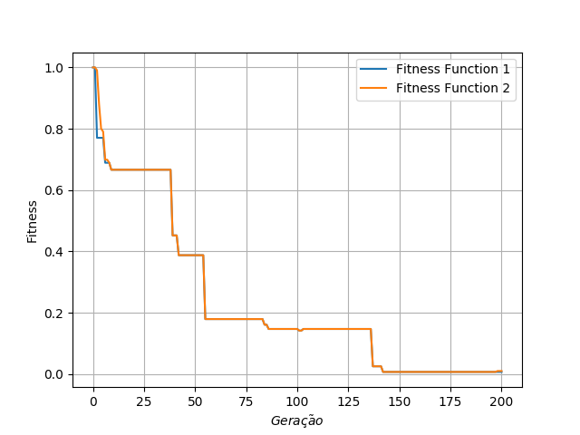
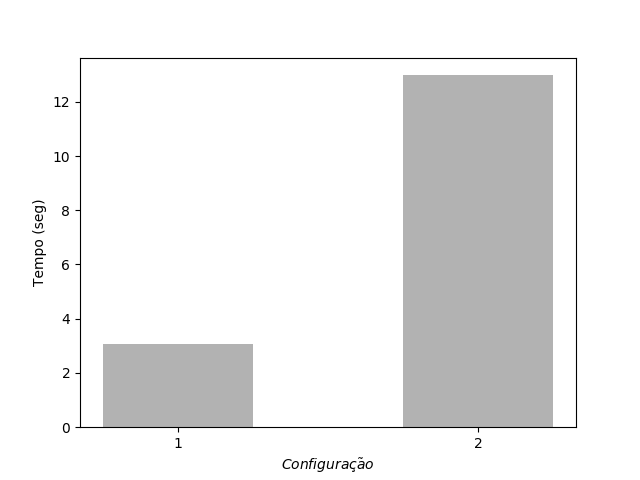
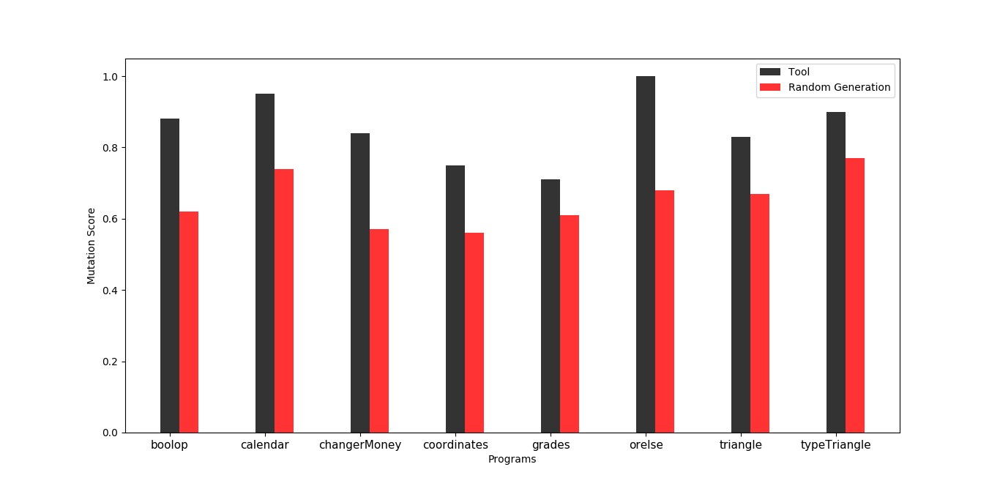
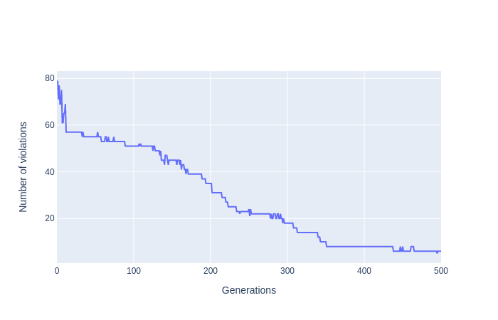

# Plots Example

This repository contains examples of different types of plots using Python visualization libraries.

## Features

- Line plots using Matplotlib
- Bar plots with customizable legends
- Interactive plots using Plotly
- Bubble plots using Bokeh

## Setup

1. Clone the repository:
```bash
git clone https://github.com/fcarlosmonteiro/plots-example.git
cd plots-example
```

2. Install dependencies:
```bash
pip install -r requirements.txt
```

## Usage

Each plot type has its own script:

- `lineplot.py`: Creates a simple line plot with two fitness functions
- `barplot.py`: Creates a bar plot showing execution times
- `barplot-legend.py`: Creates a bar plot with custom legends
- `line-plotly.py`: Creates an interactive line plot using Plotly
- `bubbleplot.py`: Creates a bubble plot using Bokeh

## Examples

**Line plot**


**Bar plot**


**Bar plot with legends**


**Line plot with plotly**


## Contributing

Feel free to submit issues and enhancement requests!
